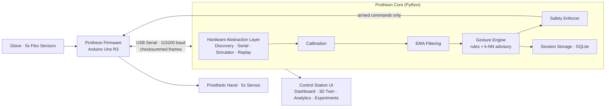

<div align="center">

# PROTHEON

### The control layer for next-generation prosthetic hands.

**Sense. Decide. Move. Safely.**


[Why Protheon](#-why-protheon) · [Product](#-the-product) · [Quick Start](#-quick-start) · [Architecture](#-architecture) · [Hardware](#-hardware) · [Roadmap](#-roadmap)

<br/>


<sub><i>Protheon Control Station: live telemetry, glove visualizer, and safety state on one screen.</i></sub>

</div>

---

## 💡 Why Protheon

**Millions of people** worldwide live with upper-limb loss. Many advanced bionic hands cost more than a car, while low-cost DIY hands are often open-loop and hard to measure or tune.

What's been missing is the **software layer between the sensors and the motors**: one place to measure, calibrate, learn, and stay safe.

**Protheon is that layer.**

We're building an open, hardware-agnostic control platform that turns low-cost sensors and servos into a measurable, tunable, and **safe** prosthetic system. Researchers, makers, and clinicians can iterate on it in hours instead of months.

> **Our thesis:** the next leap in affordable prosthetics will come from better software, not more expensive hardware.

---

## 🚀 The Product

Protheon has two tightly integrated layers:

| Layer | Runs on | What it owns |
|---|---|---|
| **Protheon Firmware** | Arduino Uno R3 | Real-time sensor acquisition (~50 Hz), servo actuation, and hard safety limits |
| **Protheon Control Station** | Desktop · Python + PySide6 | Filtering, calibration, gesture intelligence, ML, sessions, experiments, and visualization |

Safety-critical loops stay on the microcontroller. Fast-moving, experimental work happens in Python, so you can **build and test the whole platform without any hardware attached.**

### Core capabilities

<table>
<tr>
<td width="50%" valign="top">

#### 🖥️ Control Station
- Engineering dashboard with live telemetry tables and high-rate plots
- 2D glove visualizer and **3D digital twin** (PyOpenGL)
- Global **Emergency Stop** that is always one click away
- Clear source labels, so you always know whether you're seeing **real or simulated** data

</td>
<td width="50%" valign="top">

#### 🔌 Plug & Play Hardware
- **Automatic hardware discovery** at startup: scans serial ports and confirms Protheon firmware with a handshake
- Ignores unrelated USB serial devices
- Falls back to simulation automatically when no hardware is found
- **Never auto-arms.** A detected device goes from `CONNECTED` to `DISARMED`, and you choose when to arm it

</td>
</tr>
<tr>
<td width="50%" valign="top">

#### 🧠 Gesture Intelligence
- **Deterministic rule engine** drives actuation, so behavior is predictable
- **k-NN model** runs as an advisory layer that learns more complex gestures
- Per-user calibration profiles

</td>
<td width="50%" valign="top">

#### 📊 Research-Grade Data
- Every session, frame, and fault code is saved to **SQLite**
- **Session replay** sends recorded data back through the pipeline without moving the servos
- **Experiment mode** measures reaction times for target gestures and exports reports
- Analytics for telemetry rate, gesture distribution, and session metrics

</td>
</tr>
</table>

> [!IMPORTANT]
> **ML is advisory, never authoritative.** Every actuation command goes through deterministic rules and the safety enforcer. A model's prediction can never move a motor on its own.

---

## 🛡️ Safety

Prosthetics move parts of the human body, so safety is built in from the start.

| Layer | Guarantee |
|---|---|
| **Firmware watchdog** | Servos stop automatically if the host is silent for **3 seconds** |
| **Hard limits on the device** | Servo angles are clamped to 0–180° on the Arduino, whatever the host sends |
| **Sensor fault detection** | Readings outside the safe ADC range (10–1010) raise fault flags |
| **Checksummed protocol** | Every serial frame carries an XOR checksum, and corrupt frames are dropped |
| **Explicit arming** | Hardware is never armed automatically, including after discovery |
| **Global E-Stop** | A single control halts all actuation, and the device reports it in telemetry |
| **Simulation first** | Changes to actuation logic can be tested end-to-end before touching hardware |

---

## ⚡ Quick Start

**You need:** Python 3.9+ and Git. **No hardware required.**

```bash
# 1. Clone
git clone https://github.com/vailism/protheon.git
cd protheon

# 2. Create and activate a virtual environment
python3 -m venv .venv
source .venv/bin/activate          # Windows: .venv\Scripts\activate

# 3. Install dependencies
pip install -r backend/requirements.txt

# 4. Launch the Control Station in simulation mode
python3 backend/main_ui.py --simulate
```

Have the hardware? Flash the firmware (see [Hardware](#-hardware)), plug in the Arduino over USB, and run:

```bash
python3 backend/main_ui.py
```

Protheon finds the device by itself. You don't need to enter a port.

Prefer a terminal? A headless CLI is also available:

```bash
python3 backend/main.py --simulate          # or: --port /dev/tty.usbmodemXXXX
```

---

## 🏗️ Architecture



The **Hardware Abstraction Layer** is the key design choice. The real Arduino link, the simulator, and the replay engine share the same interface, so everything downstream behaves the same whether you're on a bench rig or a laptop on a plane.

### Repository layout

```
protheon/
├── backend/
│   ├── main_ui.py          # Control Station (desktop app)
│   ├── main.py             # Headless CLI
│   ├── phip/               # Core engine: HAL, filtering, gestures, ML, storage, replay
│   └── ui/                 # PySide6 interface: theme, topbar, sidebar, pages
├── firmware/PHIP_firmware/ # Arduino firmware (sensors, servos, safety)
├── configs/                # Example configuration
├── profiles/               # Example calibration profiles
├── docs/                   # Architecture, protocol, hardware, calibration, testing
└── tests/                  # Test suite
```

### Deep dives

| Doc | Covers |
|---|---|
| [Architecture](docs/architecture.md) | System design and data flow |
| [Serial Protocol](docs/serial_protocol.md) | Frame format, commands, checksum, watchdog |
| [Hardware](docs/hardware.md) | Wiring and power |
| [Calibration](docs/calibration.md) | Per-user sensor calibration |
| [Testing](docs/testing.md) | Test strategy |
| [Troubleshooting](docs/troubleshooting.md) | Common issues |

---

## 🔧 Hardware

### Reference build

| Component | Qty | Notes |
|---|---|---|
| Arduino Uno R3 | 1 | Powered over USB |
| Flex sensors | 5 | One per finger, each in a voltage divider |
| Servo motors | 5 | One per finger |
| External 5–6 V servo supply | 1 | **Required.** Must share ground with the Arduino |

### Pin map

| Finger | Flex input | Servo output |
|---|:---:|:---:|
| Thumb | `A0` | `D3` |
| Index | `A1` | `D5` |
| Middle | `A2` | `D6` |
| Ring | `A3` | `D9` |
| Pinky | `A4` | `D10` |

### Flash the firmware

1. Open `firmware/PHIP_firmware/PHIP_firmware.ino` in the Arduino IDE.
2. Select **Arduino Uno** and the correct port.
3. Click **Upload**.
4. **Close the Serial Monitor.** Only one program can hold the port at a time.

> [!CAUTION]
> **Before connecting servos:**
> - Power the servos from an **external supply**, never from the Arduino's 5V pin.
> - The external supply and the Arduino **must share a common ground**.
> - Test servos **unloaded** before attaching them to the hand's linkages.

---

## 🧰 Tech Stack

| Area | Technology |
|---|---|
| Firmware | Arduino C++ |
| Core engine | Python 3.9+ |
| Interface | PySide6, PyQtGraph, PyOpenGL |
| Data & ML | NumPy (custom k-NN, no heavy ML dependencies) |
| Storage | SQLite |
| Transport | USB serial (pySerial), 115200 baud |

---

## 🧪 Testing

```bash
pytest tests/
```

The suite covers filtering, storage, gesture state, the hardware bridge, and diagnostics.

---

## 🗺️ Roadmap

| Phase | Milestone | Status |
|---|---|:---:|
| **V1** | Firmware, serial protocol, safety watchdog | ✅ |
| **V2** | Core engine: HAL, gestures, ML, sessions, replay, experiments | ✅ |
| **V2** | Control Station UI and automatic hardware discovery | ✅ |
| **V3** | Physical hardware validation and tuning on the reference build | ⏳ In progress |
| **V4** | **EMG** muscle-signal control, beyond the glove | 🔜 |
| **V4** | **IMU** for wrist orientation and spatial awareness | 🔜 |
| **V5** | **Force-sensing fingertips** with closed-loop grip | 🔜 |
| **V5** | **ESP32** wireless, cable-free operation | 🔜 |

---

## 🩺 Troubleshooting

| Problem | Fix |
|---|---|
| Hardware not detected | Check the firmware is flashed and the Serial Monitor is closed, then click **Scan** |
| Serial port busy | Another program (often the Arduino IDE) is holding the port. Close it |
| Permission denied (Linux) | `sudo usermod -aG dialout $USER`, then log out and back in |
| Servos jitter or the Arduino resets | Servos are drawing power from the Arduino. Use an external supply with a shared ground |
| Servos stop after ~3 s | The watchdog tripped. Check the USB cable and that the app is running |
| Import errors | Activate the venv and re-run `pip install -r backend/requirements.txt` |

---

## 🤝 Contributing

Protheon is open source, and contributions are welcome.

1. Fork the repo and create a feature branch.
2. Make your change and run `pytest tests/`.
3. Open a pull request explaining **what** changed and **why**.

> Any change to actuation or the safety enforcer **must be validated in simulation first.**

Have an idea, a use case, or a lab that wants to pilot Protheon? [Open an issue](https://github.com/vailism/protheon/issues).

---

## ⚠️ Disclaimer

Protheon is a **research and development platform**. It is **not a certified medical device** and is not intended for clinical use or diagnosis.

---

## 📄 License

Released under the [MIT License](LICENSE).

---

<div align="center">

**PROTHEON**

*Safe by design. Smart by software.*

Built for the millions who deserve a better hand.

</div>