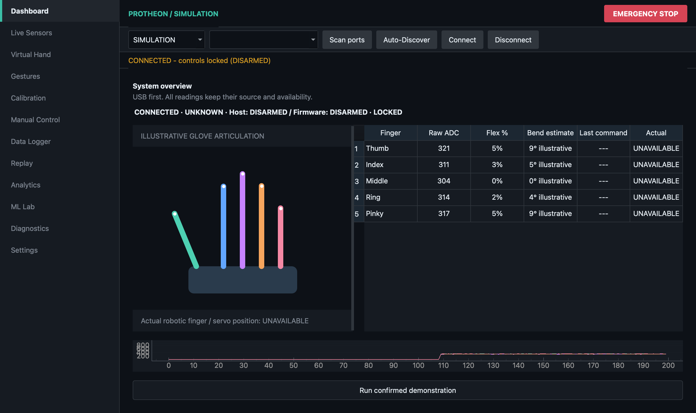
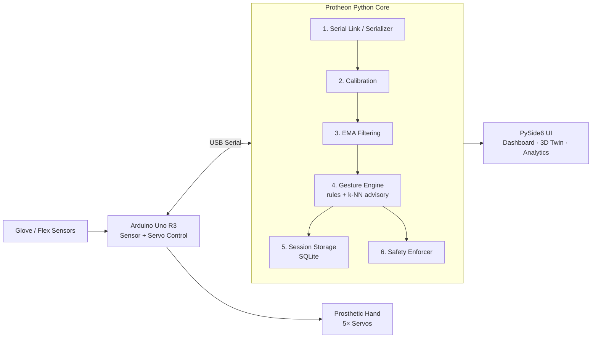

<div align="center">

# 🦾 PROTHEON

### Intelligent Prosthetic Hand Control Platform

Real-time sensing, safe actuation, gesture intelligence, and a 3D digital twin — with or without hardware.


[Quick Start](#-quick-start) · [Features](#-features) · [Architecture](#-architecture) · [Hardware](#-hardware-setup) · [Roadmap](#-roadmap)

</div>

<!-- Add a screenshot or GIF of the dashboard + 3D digital twin here:
<p align="center"></p>
-->

---

## 📖 Overview

Protheon is a prosthetic and robotic hand control platform split into two cleanly separated layers:

| Layer | Runs on | Responsibility |
|---|---|---|
| **Firmware** | Arduino Uno R3 | Real-time sensor acquisition and hard safety constraints on the servos |
| **Desktop app** | Python + PySide6 | Filtering, gesture recognition, machine learning, session storage, trial analysis, and 3D visualization |

The result: the safety-critical loop stays on the microcontroller, while all the complex, experimental work lives in a flexible Python ecosystem you can develop and test **without any hardware attached**.

---

## ✨ Features

### 🖥️ Engineering Interface
- **Modular dashboard** with real-time telemetry plots and global safety-state monitoring
- **3D digital twin** — sensor-derived, real-time hand pose rendered with PyOpenGL
- **Diagnostics & safety** — fault injection for simulation testing, live connection telemetry, and a mandatory global **Emergency Stop**

### 🧠 Intelligence & Analytics
- **Hybrid gesture engine** — user-configurable deterministic rules drive actuation for predictable safety; a **k-NN model** runs as an *advisory overlay* that learns and predicts more complex gestures
- **Academic experiment mode** — trial runners that record cognitive/physical reaction times to target gestures, with automated exportable reports
- **Engineering analytics** — session metrics, average telemetry frequency, and gesture distribution

### 🔧 Core Infrastructure
- **Hardware Abstraction Layer (HAL)** — decoupled simulator and physical serial links, so the full app runs with no hardware
- **Session replay engine** — re-injects recorded sessions into the application bus **without activating physical servos**
- **SQLite storage** — every session, telemetry frame, and status code is persisted automatically

> **Design principle:** ML is advisory, never authoritative. Actuation always passes through deterministic rules and the safety enforcer.

---

## 🏗️ Architecture



The HAL lets the **simulator** stand in for the Arduino link, and the **replay engine** stand in for live sensors — everything downstream behaves identically.

---

## 🚀 Quick Start

**Requirements:** Python 3.9+ and Git. No hardware needed for simulation mode.

```bash
# 1. Clone
git clone https://github.com/<your-username>/protheon.git
cd protheon

# 2. Create a virtual environment
python3 -m venv .venv
source .venv/bin/activate          # Windows: .venv\Scripts\activate

# 3. Install dependencies
pip install -r backend/requirements.txt

# 4. Launch in simulation mode (no hardware required)
python3 backend/main_ui.py --simulate
```

To run against real hardware, complete the [Hardware Setup](#-hardware-setup) and launch without the flag:

```bash
python3 backend/main_ui.py
```

---

## 🛠️ Hardware Setup

### Bill of materials

| Component | Qty | Notes |
|---|---|---|
| Arduino Uno R3 | 1 | Powered via USB |
| Flex sensors | 5 | Each in a voltage divider |
| Servo motors | 5 | **External power supply required** |
| External servo power supply | 1 | Shared ground with the Arduino |

### Pin mapping

| Function | Pins |
|---|---|
| Flex sensor inputs (analog) | `A0` – `A4` |
| Servo outputs (PWM) | `3`, `5`, `6`, `9`, `10` |

### Firmware upload

1. Open `firmware/PHIP_firmware/PHIP_firmware.ino` in the Arduino IDE.
2. Select **Arduino Uno** as the board and the correct port.
3. Click **Upload**.
4. **Close the Arduino IDE Serial Monitor** before launching the Python app — only one program can hold the serial port.

### ⚠️ Critical safety directives

> [!CAUTION]
> Read these before connecting any servos.

- **Servo power:** Servos **MUST** be powered from an external supply. Never power them from the Arduino's 5V pin.
- **Common ground:** The external supply and the Arduino **MUST** share a common ground.
- **Unloaded verification:** Always test servos unloaded before attaching them to the mechanical hand linkages.
- **E-Stop & watchdog:** The Arduino automatically stops all servos if the USB connection drops or stalls for more than **3 seconds**.

---

## 🧰 Tech Stack

| Area | Technology |
|---|---|
| Firmware | Arduino C++ |
| Backend core | Python 3.9+ |
| UI / graphics | PySide6, PyQtGraph, PyOpenGL |
| Data & ML | Pandas, NumPy, scikit-learn |
| Storage | SQLite3 |

---

## 🧪 Testing

The test suite covers data filtering, database handling, gesture states, hardware bridging, and diagnostics.

```bash
cd backend
pytest tests/
```

---

## 🩺 Troubleshooting

| Problem | Likely cause / fix |
|---|---|
| Serial port busy or won't open | The Arduino IDE Serial Monitor (or another program) is holding the port — close it |
| Permission denied on the serial port (Linux) | Add your user to the `dialout` group, then log out and back in |
| Servos jitter or the Arduino resets | Servos are drawing power from the Arduino, or grounds aren't shared — use an external supply with a common ground |
| Servos stop after a few seconds | The 3-second watchdog tripped; check the USB connection and that the app is running |
| App won't start / import errors | Confirm the virtual environment is active and `pip install -r backend/requirements.txt` completed |
| Want to try the app without a device | Run with `--simulate` |

---

## 🗺️ Roadmap

| Status | Item |
|:---:|---|
| ✅ | Software V2 engine |
| ✅ | Professional UI/UX redesign |
| ⏳ | Physical hardware validation and tuning |
| 🔜 | EMG (electromyography) integration |
| 🔜 | IMU for spatial awareness |
| 🔜 | Force-sensing fingertip feedback |
| 🔜 | ESP32 wireless connectivity migration |

---

## 🤝 Contributing

Contributions, bug reports, and ideas are welcome.

1. Fork the repo and create a feature branch.
2. Make your changes and run `pytest tests/` from `backend/`.
3. Open a pull request describing what changed and why.

Any change that touches actuation or the safety enforcer should be validated in simulation first.

---

## 📄 License

<!-- Choose a license (e.g., MIT) and add a LICENSE file, then update this line. -->
Distributed under the `<LICENSE NAME>` license. See `LICENSE` for details.

---

<div align="center">

**Protheon** — safe by design, smart by software.

</div>